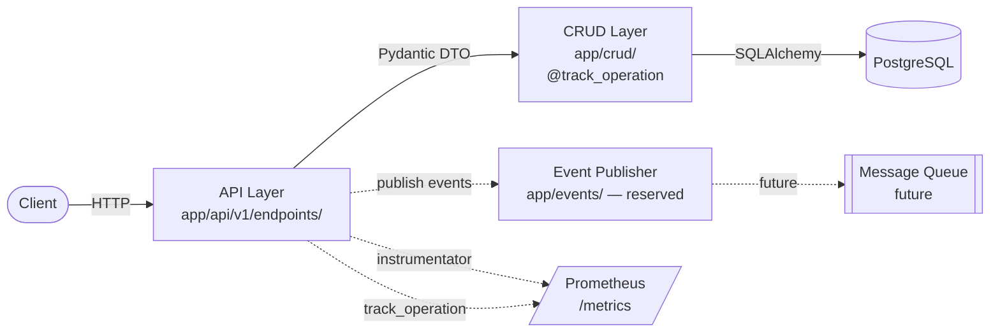

# DriveNow

Vehicle Management System for a Car Rental Company.
FastAPI + PostgreSQL + SQLAlchemy, containerized with Docker Compose,
instrumented with Prometheus.

## Architecture



Outer layers depend on inner ones, never the reverse.

### Layers

| Layer | Path | Responsibility |
|-------|------|----------------|
| **API** | `app/api/v1/endpoints/` | HTTP routing, request validation via `app/schemas/`, dependency injection of the DB session. No business rules. |
| **Schemas** | `app/schemas/` | Pydantic DTOs. The only types that cross the API boundary — ORM objects never leave the CRUD layer. |
| **CRUD** | `app/crud/` | SQLAlchemy data access (create / get / list / update). Currently the data + light-business layer; rentals will likely promote a separate service layer. |
| **Models** | `app/models/` | SQLAlchemy ORM definitions. UTC-aware timestamps via `TimestampMixin`. |
| **Core** | `app/core/` | Cross-cutting infrastructure: settings, DB engine, logging, Prometheus metrics. |
| **Events** | `app/events/` | Reserved for message-broker integration. Stub publisher today, broker-aware tomorrow. |
| **Services / Repositories** | `app/services/`, `app/repositories/` | Empty packages reserved for the next iteration when rentals introduce business rules and locking. |

## Quickstart

```bash
docker compose up --build
```

On boot, the `api` container runs `alembic upgrade head` and then starts uvicorn.

| Endpoint | Purpose |
|----------|---------|
| `GET /health` | Liveness check |
| `GET /metrics` | Prometheus exposition (API + service-layer histograms) |
| `GET /docs` | OpenAPI / Swagger UI |

## API usage

### Create a car

```bash
curl -s -X POST http://localhost:8000/api/v1/cars \
  -H 'content-type: application/json' \
  -d '{"model": "Tesla Model 3", "year": 2024}'
```

```json
{
  "id": 1,
  "model": "Tesla Model 3",
  "year": 2024,
  "status": "AVAILABLE",
  "created_at": "2026-04-29T04:41:27.797189Z",
  "updated_at": "2026-04-29T04:41:27.797189Z"
}
```

`status` defaults to `AVAILABLE`. Allowed values: `AVAILABLE`, `IN_USE`,
`MAINTENANCE`. `year` is constrained to 1900–2100; `model` to 1–100 chars.

### List cars (with optional filter + pagination)

```bash
curl -s http://localhost:8000/api/v1/cars
curl -s "http://localhost:8000/api/v1/cars?status=AVAILABLE"
curl -s "http://localhost:8000/api/v1/cars?status=MAINTENANCE&limit=20&offset=0"
```

`limit` is capped at 200, `offset` defaults to 0. Result is sorted by `id` ascending.

### Update a car (partial)

```bash
curl -s -X PATCH http://localhost:8000/api/v1/cars/1 \
  -H 'content-type: application/json' \
  -d '{"status": "MAINTENANCE"}'
```

```json
{
  "id": 1,
  "model": "Tesla Model 3",
  "year": 2024,
  "status": "MAINTENANCE",
  "created_at": "2026-04-29T04:41:27.797189Z",
  "updated_at": "2026-04-29T04:41:27.839032Z"
}
```

Only the fields you send are updated. Unknown `id` returns `404 {"detail": "Car not found"}`.

## Metrics

Two complementary instrumentation paths feed `/metrics`:

- **`http_request_duration_seconds_*`**, **`http_requests_total`** — produced
  automatically by `prometheus-fastapi-instrumentator`; covers every API
  request.
- **`drivenow_service_operation_duration_seconds_*`**,
  **`drivenow_service_operation_total`** — produced by `app/core/metrics.py`;
  one labelled time series per business operation (`operation`, `status`).

To track a new operation:

```python
from app.core.metrics import track_operation

@track_operation("rental.book")
def book(car_id: int, ...) -> Rental: ...
```

Recorded labels: `operation` (the name you pass), `status` (`success` /
`error`). The decorator works on both sync and async callables and
preserves the wrapped signature, so it's safe on FastAPI route handlers.

Confirmed live after car CRUD usage:

```
drivenow_service_operation_total{operation="car.create",status="success"} 1.0
drivenow_service_operation_total{operation="car.list",  status="success"} 2.0
drivenow_service_operation_total{operation="car.update",status="success"} 1.0
```

## Migrations

Alembic is wired up. The `api` container runs `alembic upgrade head` on every
boot — migrations are part of the deployment, not a manual step.

```bash
# Create a new revision after editing models
docker compose run --rm api alembic revision --autogenerate -m "describe change"

# Apply / roll back manually
docker compose exec api alembic upgrade head
docker compose exec api alembic downgrade -1
```

Initial migration ([alembic/versions/0001_initial_schema.py](alembic/versions/0001_initial_schema.py))
creates `cars`, `rentals`, and the `carstatus` enum.

## Tests

```bash
docker compose exec api pytest tests/test_api/test_cars.py -v
```

The smoke test ([tests/test_api/test_cars.py](tests/test_api/test_cars.py))
uses an **in-memory SQLite** engine with `StaticPool` so the test is fast
and self-contained (no Postgres required for unit-style tests). It
overrides FastAPI's `get_db` dependency and asserts:

- `POST /api/v1/cars` → 201 with the expected body.
- `GET /api/v1/cars` → returns the created car.
- `GET /api/v1/cars?status=MAINTENANCE` → returns `[]`.

> Gotcha worth knowing: `sqlite:///:memory:` without `StaticPool` gives
> each new SQLAlchemy session its own empty in-memory database. Sharing
> a single connection via `StaticPool` is what makes the test see the
> tables created in the fixture.

## Development conventions

- **UTC everywhere.** All timestamp columns are `timestamptz`. Application
  code constructs datetimes with `datetime.now(timezone.utc)`. Naive
  datetimes never enter the DB. `TZ=UTC` is set in both the API and
  Postgres containers; Postgres reports `SHOW timezone;` → `UTC`.
- **No ORM objects across the API boundary.** Endpoints accept and return
  Pydantic models from [app/schemas/](app/schemas/); CRUD returns ORM
  objects to the API which maps them through `CarRead.model_validate(...)`.
  This keeps the wire format decoupled from storage and prevents
  accidentally leaking internal columns.
- **Logs go to stdout *and* `logs/app.log`** (rotating, 10 MB × 5 backups,
  UTC ISO timestamps). The host `./logs` directory is bind-mounted; it
  must exist with UID 1000 ownership before the first `docker compose up`
  (the tracked `logs/.gitkeep` ensures this).
- **The `api` container runs as non-root** (`appuser`, UID 1000) so the
  bind-mounted `./logs` is writable from inside.

## Database choice

PostgreSQL.

- Rentals and cars are a natural relational pair: `rentals.car_id` is a
  hard FK with `ON DELETE CASCADE`. Joining and filtering on relations
  is the dominant access pattern, which is what relational engines are
  optimized for.
- `timestamptz` correctly stores datetimes as UTC regardless of client
  timezone — important for a rental product where bookings cross
  timezones and a "server local time" assumption silently corrupts data
  at booking boundaries.
- The next iteration prevents overlapping rentals on the same car using
  Postgres's `tstzrange` + `EXCLUDE USING gist (... WITH &&)` constraint
  (requires the `btree_gist` extension shipped in `postgres-contrib`).
  This DB-level guarantee is impossible in a typical document store and
  hard to do correctly at the application level under concurrency.

## Layout

```
app/
├── api/
│   └── v1/endpoints/   # FastAPI routers — currently: cars.py
├── crud/               # SQLAlchemy data access — currently: crud_car.py
├── models/             # SQLAlchemy ORM (Car, Rental, TimestampMixin)
├── schemas/            # Pydantic DTOs (car.py)
├── services/           # reserved — promoted in next iteration for rentals
├── repositories/       # reserved — see services/
├── events/             # reserved publisher stub for future broker
├── core/               # config, database, logging, metrics
└── main.py             # FastAPI app entrypoint
alembic/                # schema migrations (0001 = cars, rentals, carstatus enum)
tests/
└── test_api/           # smoke test for car CRUD
docs/                   # additional architecture docs (placeholder)
logs/                   # host-mounted log dir (.gitkeep tracked)
```

## Out of scope (next iterations)

- Rentals endpoints (book, end, list, status transitions, overlap
  prevention via `EXCLUDE USING gist`).
- Car `DELETE` endpoint (with "cannot delete car with active rental"
  guard).
- Promote the `app/services/` layer for rental business rules; align
  the `app/crud/` vs `app/repositories/` naming.
- More tests (assignment requires ≥ 4 unit tests; currently 1 smoke
  test).
- Real message broker — `app/events/publisher.py` is a no-op today.
- Auth, rate limiting.
